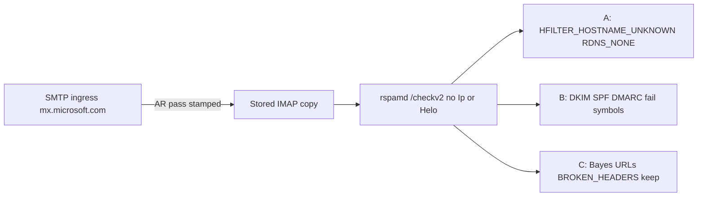

# Next: IMAP-path auth remediation (A+B)

The durable map and project memory agree. The older “do a full security review next” note is superseded by the 2026-09-23 lock in [IMPLEMENTATION_STATUS.md](IMPLEMENTATION_STATUS.md) and [SESSION_HANDOFF.md](SESSION_HANDOFF.md).

**Do this next.** Implement buckets A and B. Leave every account in `mode: shadow`. Do not zero `BROKEN_HEADERS` in the same change.

## Why this is blocking

Proofpoint/M365 already scored these messages at SMTP ingress and stamped `Authentication-Results: mx.microsoft.com` with `spf=pass`, `dkim=pass`, `dmarc=pass`. This filter IMAP-fetches the stored copy and posts it to rspamd `/checkv2` with no `Ip`/`Helo` ([design-arch/slice6_rspamd_scan_metadata.md](design-arch/slice6_rspamd_scan_metadata.md)). Rspamd then re-checks auth against a body whose SHA-256 does not match the DKIM `bh=` Microsoft already verified (Amazon Inbox UID **235843**). Ham training cannot cancel those symbols, so leaving shadow now would Junk a lot of good mail.

Google sample: rich_bytecave Inbox UID **235853**, `no-reply@accounts.google.com`, score **+18.50** (`BROKEN_HEADERS=+8`, `HFILTER_HOSTNAME_UNKNOWN=+2.5`, `DMARC_POLICY_REJECT=+2`).

## Locked policy

- **A — zero** `HFILTER_HOSTNAME_UNKNOWN` and `RDNS_NONE`. No client IP on this architecture, so ham and spam pay the same penalty.
- **B — suppress failure weight only when** authserv-id `mx.microsoft.com` says that check **pass**. If the AR says fail, is missing, or comes from any other authserv, **keep** `R_DKIM_REJECT`, `R_SPF_FAIL`, `DMARC_POLICY_*`, and `BLACKLIST_DMARC`. Do not blanket-disable auth scoring. Do not trust Microsoft SCL or the Junk folder.
- **C — keep** Bayes, URLs, fuzzy, neural, lists, and `BROKEN_HEADERS`. Investigate MIME/`MIME_TRACE` part `2:~` only after A+B, as a separate change.

## Implementation

1. Confirm exact 4.2.0 knob names inside `spamfilter-rspamd` (`rspamadm confighelp` / shipped `arc.conf`, `dkim.conf`, `dmarc.conf`, `hfilter.conf`) before writing config. Prefer rspamd mechanisms: symbol score 0 for bucket A; for bucket B, `trusted_authserv_id` plus ARC `whitelisted_signers_map` (`microsoft.com`) and `adjust_dmarc`. Add a small post-scan helper in [filter/filter.py](filter/filter.py) only if those knobs cannot express “suppress this failure symbol only when this authserv says pass.”
2. Put the config in git [rspamd/local.d/](rspamd/local.d/) (new `groups.conf` or module `local.d` files, not a global score cut in [rspamd/local.d/actions.conf](rspamd/local.d/actions.conf)). Live rspamd does **not** mount the git tree: [deploy/bytelord-compose.yaml](deploy/bytelord-compose.yaml) bind-mounts `/opt/bytelord/data/imap-spamfilter/rspamd/local.d`. After `rspamadm configtest`, copy the new files there and reload/recreate **only** `spamfilter-rspamd`. Do not `compose down` Redis.
3. Document the rule in the README known-limitations paragraph (around the existing IMAP-path note) and update the two status docs’ “what’s next” once validation passes. Bump [unraid/bootstrap.version](unraid/bootstrap.version) so a later bootstrap refresh installs the new `local.d` files.
4. Validate with `docker exec spamfilter python explain_score.py …` and Messages `score_detail`:
   - Google UID **235853** (rich_bytecave)
   - Amazon UID **235843**
   - a known **auth-fail** spam message (must stay high)
   - an auth-pass phishing/BEC sample if one exists (content symbols must still fire)
   Success: the two legit samples fall under the reject line (~15) without a free pass for auth-fail spam. `BROKEN_HEADERS` may still keep some legit mail over 15; that is expected and is the next investigation, not part of this change.

## After A+B, not in this change

Investigate bucket C `BROKEN_HEADERS` / `MIME_TRACE` on the same samples, then decide a narrow exception or leave it scored. Stay in shadow until dashboard scores look sane. Promote `flag` then `move` only when asked. Full code/security review and CR-016 supply-chain pins stay later.