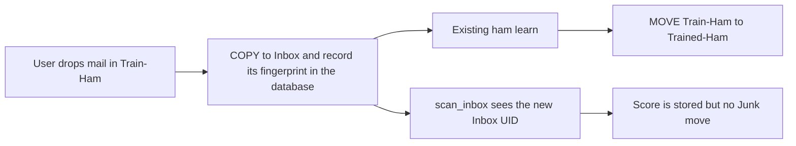

# Hold Train-Ham restores in the Inbox

Yes. The re-junk is not inherent to IMAP. It is one branch in `[filter/filter.py](filter/filter.py)` `scan_inbox`: a new Inbox UID with no prior action is scored, and `score >= threshold` (8) calls `add_pending_move`. `drain_train_ham` already runs before `scan_inbox` in `_run_account`, so a mark written during the Train-Ham pass is visible before that score move.

## Behavior

For every account, including shadow:

- On each still-unrestored message in Train-Ham, server-side `COPY` it to the Inbox before `try_learn`. This does not wait on the learn budget, so the Inbox copy appears even when training is deferred.
- If an identical copy is already in the Inbox, skip the extra copy.
- The existing learn path stays: successful ham learn still moves the Train-Ham message to Trained-Ham. The Inbox copy remains. Train-Spam is unchanged.
- A failed learn leaves the Train-Ham message in place for retry. The Inbox copy, once made, stays.

## Why a score of 8 or more will not send it back to Junk

There is already a precedent: a user Junk-to-Inbox revert hits `continue` in `scan_inbox` before the threshold move. A Train-Ham restore is not that case when the message came from Archive or another non-Junk folder, so today it would be treated as ordinary new mail.

The hold:

- When the copy is made, the message bytes are not edited. The filter stores a SHA-256 fingerprint of those bytes on the Train-Ham database row (`our_action=inbox_copied`) so the later Inbox copy can be recognized. If the server returns the new Inbox UID (UIDPLUS), also set that Inbox database row to `our_action=ham_restored` before the scan.
- In `scan_inbox`, still score and store the score. A block-list hit still forces Junk, as it does now. Otherwise, if this body is a Train-Ham restore, skip shadow, flag, and `pending_move`, and record `ham_restored`.
- `execute_due_moves` only moves rows that were queued, so a skipped queue never leaves the Inbox.
- The same body taught as ham in the past, including the accidental Trained-Ham reversal, does not qualify. Only a body this restore copied is held.

A drag to Train-Ham is the behavior that changes: it gains the immediate Inbox copy and the hold against a score move. Other drags stay as they are today. Inbox-to-Junk still schedules a spam learn in `poll_junk`. A later Train-Spam drag still files that message as spam.

## Tests

In `[filter/test_core_review_fixes.py](filter/test_core_review_fixes.py)` and the train-drain tests:

- Train-Ham copies to Inbox before learn, then the learned original still lands in Trained-Ham.
- Move mode with score 9 does not queue a Junk move for that Inbox UID; the score is stored and the action is `ham_restored`.
- A block-list hit on that same body still queues Junk.
- An ordinary score of 9 with no Train-Ham sibling still queues Junk.
- An existing Inbox copy is not duplicated.
- Learn-budget exhaustion still performs the Inbox copy.
- Train-Spam still moves only to Trained-Spam.

No `accounts.yml` change. Shipping is a filter rebuild. The README Train-Ham "copy only" note in `[README.md](README.md)` needs a short correction so it describes the automatic Inbox copy.
