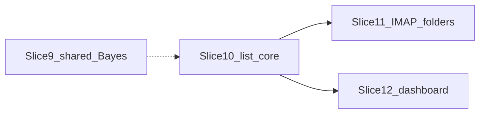

# Sliced plan: allow/block lists + shared Bayes

A sequenced set of four slices (9–12) that add server-side allow/block
lists and put every ByteLord mailbox on one rspamd Bayes notebook.
Each slice is independently mergeable with tests. Product decisions in
this file are **locked**; do not reopen them during implementation.

**Parent requirements (historical):** [`../new_requirements.md`](../new_requirements.md).
This plan and slices 9–12 are **authoritative** for implementation.
Where they disagree with the requirements capture, these slices win.

**Where this will run.** Coding starts against this repo; live
`accounts.yml` is gitignored at
`/opt/bytelord/projects/imap-spamfilter/accounts.yml` (compose-mounted
into the `spamfilter` container). State DB:
`/opt/bytelord/data/imap-spamfilter/state/spamfilter.db`.

Slice 9 is independent of lists and should ship first (training
economics). Slices 11 and 12 both depend on 10 and may overlap after
10. Caddy / Netbird / `spam.bytelord.net` is **not** a slice.

## Status

| Slice | Status | Spec |
|---|---|---|
| 9 - One VPS Bayes | ready to implement | [`slice9_shared_bayes.md`](slice9_shared_bayes.md) |
| 10 - List core | ready to implement | [`slice10_list_core.md`](slice10_list_core.md) |
| 11 - IMAP list folders | ready to implement | [`slice11_imap_list_folders.md`](slice11_imap_list_folders.md) |
| 12 - Dashboard lists | ready to implement | [`slice12_dashboard_lists.md`](slice12_dashboard_lists.md) |

---

## Locked product decisions

Specs 9–12 must implement these. Do not invent a different policy
“while we’re here.”

**Override vs score vs Bayes**

- Scoring still runs (`rspamd_scan`) and the numeric score is stored
  and logged.
- Lists override **routing only** (keep in Inbox vs flag vs MOVE to
  Junk). A list hit never calls `rspamd_learn`.
- Train-* and Inbox↔Junk moves remain the only learn paths.

**Headers**

- **Scan/match:** From, Sender, and Reply-To (all three).
- **IMAP drag write:** From address only. Never a whole-domain pattern
  from a folder gesture.

**Conflicts / precedence**

Specificity, highest wins:

1. Person-list **address** (`actual_name` + `user@host`)
2. Domain-list **address** (roster domain + `user@host`)
3. Domain-list **whole domain** (`@host`)

Same specificity: **allow beats block**. When both kinds match at the
winning specificity, still allow, and log `list_conflict`.

**Scopes**

- **Person lists** keyed by required YAML `actual_name` (exact display
  string, not lowercased). One person → one allow list and one block
  list, shared across every account with that `actual_name`. Addresses
  only.
- **Domain lists** keyed by a YAML **roster** domain. One allow and one
  block per roster domain. Addresses and `@domain` / `domain`. The
  dashboard cannot add, rename, or delete roster domains.

**Roster (ByteLord v1)**

| Domain | Type |
|---|---|
| `bytecave.net` | company |
| `eizenhoefer.net` | personal |
| `rjmetalfab.com` | company |
| `bytelord.net` | company |

`company` vs `personal` is **metadata only** in v1 (dropdown
grouping/label). Matching does not change by type.

**YAML vs SQLite**

- YAML: which domains exist, `actual_name` per account, `bayes_user`,
  list caps. **No** allow/block entries in YAML.
- SQLite: every list row. Survives restarts; already in the state-DB
  backup story.

**IMAP gesture**

- Folders: `INBOX/Allowlist` and `INBOX/Blocklist` (delimiter-aware).
- Drag upserts a person-list **address**, then MOVE the message **back
  to Inbox** (mail must not be lost).
- Drag the same sender to the other folder **flips** allow ↔ block
  (sibling row removed).
- Shadow **may** CREATE those folders, drain them, and MOVE back to
  Inbox. Shadow still must not auto-MOVE Inbox → Junk or run Junk →
  Trash retention.

**Where lists apply**

- Inbox `scan_inbox` only. **Not** Junk poll. v1 does not pull
  allowlisted mail out of Junk.

**Caps**

- `max_list_per_run` default **100** (IMAP drain batch).
- `max_list_entries` default **1000** per
  `(scope_type, scope_key, kind)`.

**Dashboard v1**

- Existing signed-session login. **Admin only.** No OAuth2. Netbird +
  Caddy hostname is later ops.
- Two tabs: Domain lists | User lists.
- Per tab: dropdown, Allow|Block toggle, **one** textarea (one pattern
  per line), find-in-text search that does **not** hide lines, Save and
  Cancel enabled only when dirty, warn on dropdown / toggle / tab /
  browser leave if dirty.
- Save: trim lines, skip blanks, reject internal whitespace and invalid
  syntax with caret on the first bad line, collapse case-insensitive
  duplicates, replace that list in a transaction, **remove the pattern
  from the sibling list**.

**Bayes**

- One VPS notebook: same `bayes_user` (e.g. `bytelord`) on every
  account. No shop vs personal split. Fresh notebook (no Redis merge).
- Re-feed later via existing `bootstrap_train.py` against Trained-*
  (documented on slice 9; not slice 9 code).

**Case**

- Store and match patterns **lowercased**. `actual_name` stays
  case-preserving (exact match).

---

## Not in these slices

Do not “while we’re here” any of:

- Caddy `spam.bytelord.net`, DNS, Netbird ACLs
- OAuth2 / SSO for the dashboard
- Applying list hits on Junk poll / un-junking from allowlist
- Wildcard patterns (`*@`, `@*.example.com`)
- Import from Microsoft 365 safe senders
- Redis merge of old per-mailbox Bayes keys
- Non-admin dashboard logins for Steve/Bobbi/Marilyn
- Auto-allowlisting a mailbox’s own domain
- Subject / attachment allow rules

---

## Suggested implementation order

1. Slice 9 (config + docs; live `accounts.yml` `defaults.bayes_user`)
2. Slice 10 (schema + matcher; tests without IMAP/UI)
3. Slice 11 and/or 12 (IMAP usable without dashboard; dashboard usable
   without IMAP)

Live ByteLord `accounts.yml` edits (roster, `actual_name`,
`bayes_user`) happen on the VPS file; they are not committed.
