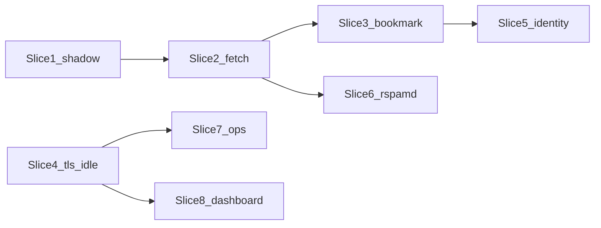

# Sliced plan: code-review fixes

A sequenced set of 8 slices that fix the confirmed code-review bugs in
order of deploy risk. Each slice is independently mergeable with tests.
The first three make a true shadow evaluation safe against Microsoft 365;
the rest close security, identity, and ops gaps before promoting
accounts to flag/move.

Confirmed against current [`filter/filter.py`](../filter/filter.py). Scope is the review findings in [`design-arch/spamfilter_discussion_and_code_review.md`](spamfilter_discussion_and_code_review.md). **OAuth / `email-oauth2-proxy` is a follow-on track** after Slice 4 (it needs an explicit `tls_mode: none` for localhost LOGIN).

**Where this will run.** Coding starts on the local desktop; implementation against the live stack happens over SSH on the Linux VPS. Secrets live **outside the git tree** at `/opt/bytelord/secrets/imap-spamfilter.env` (not `imap-spamfilter/.env`). Slice 7 should teach Compose/docs to use `docker compose --env-file /opt/bytelord/secrets/imap-spamfilter.env` (or an equivalent `env_file:` that points at that path). Never copy that file into the repo. `accounts.yml` remains gitignored; the external secrets file is the controller/Redis password source of truth, with no state-directory password copies.

Shadow-mode policy (your choice): **hybrid**. Inbox / Junk / Trash are never mutated in `shadow`. Creating `Train-*` folders and draining them (learn + MOVE to `Trained-*`) remains allowed so Bayes can be bootstrapped while scores are evaluated.

Slices 1-3 are the PoC-critical path (do these before connecting real mailboxes, even in shadow). Slice 4 is independent and can run in parallel with 2/3. Slices 5-8 come after a working shadow eval.

## Status

| Slice | Status | Spec |
|---|---|---|
| 1 - Hybrid shadow mode | done | [`slice1_hybrid_shadow_mode.md`](slice1_hybrid_shadow_mode.md) |
| 2 - IMAP fetch discipline | done | [`slice2_imap_fetch_discipline.md`](slice2_imap_fetch_discipline.md) |
| 3 - Reliable Inbox bookmark | done | [`slice3_inbox_bookmark.md`](slice3_inbox_bookmark.md) |
| 4 - TLS / YAML booleans / IDLE | done | [`slice4_connection_config.md`](slice4_connection_config.md) |
| 5 - Message identity | done | [`slice5_message_identity.md`](slice5_message_identity.md) |
| 6 - Rspamd scan metadata | done | [`slice6_rspamd_scan_metadata.md`](slice6_rspamd_scan_metadata.md) |
| 7 - Ops / secrets / supply chain | done | [`slice7_ops_secrets_supply_chain.md`](slice7_ops_secrets_supply_chain.md) |
| 8 - Dashboard + log redaction | done | [`slice8_dashboard_hardening.md`](slice8_dashboard_hardening.md) |

---

## Slice 1 — Hybrid shadow mode (P0)

**Spec:** [`slice1_hybrid_shadow_mode.md`](slice1_hybrid_shadow_mode.md) (architecture, call sites, tests, acceptance).

**Why first:** README and `accounts.yml.example` promise `shadow` is scan+log only. Today the account loop in [`filter/filter.py`](../filter/filter.py) (`_run_account` ~1842-1864) runs `ensure_folders`, `drain_train_*`, `poll_junk`, and `retention_sweep` regardless of mode. Defaults (`junk_retention_days=10`) can MOVE aged Junk to Trash on day one.

**Write policy**

| Action | shadow | flag | move |
|---|---|---|---|
| FETCH / SEARCH / LIST / IDLE | yes | yes | yes |
| CREATE+SUBSCRIBE Train-* | yes | yes | yes |
| Drain Train-* (learn + MOVE to Trained-*) | yes | yes | yes |
| STORE `\Flagged` on Inbox | no | yes | no (move path does not flag) |
| MOVE Inbox to Junk | no | no | yes |
| Retention MOVE Junk/Trained-* to Trash | no | yes | yes |
| Bayes learn from observed Inbox<->Junk user moves | yes (no IMAP write) | yes | yes |

**Implementation**

- Add a small helper, e.g. `imap_writes_allowed(acc, action)`, and use it at the four unguarded call sites: `ensure_folders` (Inbox/Junk/Trash stay read-only probes; Train-* CREATE stays allowed in shadow), `retention_sweep` (skip entirely in shadow), `scan_inbox` SELECT (`readonly=True` in shadow), `execute_due_moves` (already gated).
- Inbox/Junk SELECT in shadow must be `readonly=True` so a FETCH cannot set `\Seen`.
- Keep Train-* drain on; it is the intended bootstrap path.
- Update README / `accounts.yml.example` so the hybrid contract is explicit (Train-* writes are allowed; Inbox/Junk/Trash are not).

**Tests:** mode matrix against a FakeIMAP that records CREATE/MOVE/STORE. Assert shadow never MOVEs Junk->Trash or STORE-flags Inbox, and still CREATEs/drains Train-*.

**Files:** [`filter/filter.py`](../filter/filter.py), [`filter/test_learn.py`](../filter/test_learn.py) (extend `_FakeIMAP` / `_mk_account`), README, `accounts.yml.example`.

---

## Slice 2 — IMAP fetch discipline (size cap + Junk watermark)

**Why together:** both live in the same FETCH loops (`scan_inbox` ~1219-1223, `poll_junk` ~1403-1407, `_drain_train_folder` ~1563). Doing them apart means rewriting those loops twice.

**5 MiB cap (already decided in the review thread)**

- `MAX_FETCH_BYTES` is defined at line 78 and never enforced.
- First FETCH `RFC822.SIZE` (+ FLAGS/INTERNALDATE). Only issue `BODY.PEEK[]` when `size <= MAX_FETCH_BYTES` (keep 5 MiB, make it configurable later if needed).
- Oversized: leave in Inbox, log `skipped_oversize`, never auto-move. Fail closed.
- Apply the same cap to Junk polling and Train-* drain.

**Incremental Junk polling**

- `poll_junk` does `SEARCH ALL` + full-body FETCH every 120s. `scan_bookmark` already has `folder` in its PK ([`SCHEMA` ~396-402](../filter/filter.py)); reuse it for Junk.
- First pass: init bookmark to current max UID (same as Inbox - do not re-learn historical Junk).
- Later: `SEARCH UID {bookmark+1}:*`. User Inbox->Junk moves get a new destination UID, so training still works.
- `process_pending_learns` stays DB-driven and does not need a full-folder rescan.

**Tests:** FakeIMAP that fails if `BODY.PEEK[]` is requested for a UID whose SIZE exceeds the cap; Junk poll only FETCHes UIDs above the bookmark on the second pass.

---

## Slice 3 — Reliable Inbox bookmark

**Why before flag/move:** a short rspamd outage currently advances the bookmark past failed UIDs (`scan_inbox` ~1329-1332: `new_max = max(candidates)`), so those messages are never retried.

**Algorithm (no new table required)**

After the batch, advance only through a prefix of terminally handled UIDs:

- **Terminal (advance past):** scored successfully, already had `our_score`, seen-and-not-scoring, revert handled, no Message-ID (permanent skip + event), oversized skip from Slice 2.
- **Non-terminal (stop; do not advance past):** missing body, `rspamd_scan` returned `None`, shutdown mid-batch.

Next pass retries `UID {bookmark+1}:*`. Already-scored UIDs in that range are idempotent skips.

UIDs are not contiguous (expunges leave gaps); "prefix" means walk `sorted(candidates)` and stop at the first non-terminal UID. Bookmark stays at the last terminal UID (or unchanged).

**Tests:** three-UID fixture (ok / rspamd-down / ok) must leave the bookmark at the first success, then retry and advance after rspamd recovers.

---

## Slice 4 — Connection and config correctness

Independent of 2/3. Needed before any real IMAP login, and before the OAuth-proxy architecture.

**TLS modes** (README currently lies: `ssl: false` is not STARTTLS)

Replace boolean `ssl` with `tls_mode`:

- `implicit` -- IMAPS (default, port 993)
- `starttls` -- port 143, `starttls()` before LOGIN
- `none` -- plaintext LOGIN; refuse unless host is loopback **or** `allow_insecure_tls: true` is set

Keep `ssl:` as a deprecated alias (`true`->`implicit`, `false`->`starttls` with a startup warning) so existing `accounts.yml` files do not silently go plaintext.

Same construction exists in [`filter/bootstrap_train.py`](../filter/bootstrap_train.py) (~60-68); fix both.

**YAML booleans:** `bool("false")` is `True`. Parse `ssl` / `learn_from_moves` / `auto_special_folders` (and the new flags) with an explicit true/false set. Catch `ValueError` in `load_accounts` as `SystemExit`, matching other validation.

**IDLE fallback:** `idle_cap` is computed (~1831) and then ignored; `client.idle()` always runs. `acc.poll_interval` is stored and never read. If IDLE is absent, `time.sleep(wait)` instead of `idle()`, using `poll_interval` (not reconnect-backoff).

**Tests:** config loader cases (`ssl: "false"`, `tls_mode: none` to a non-local host must refuse); FakeIMAP without IDLE capability must not call `idle()`.

---

## Slice 5 — Message identity

Largest slice. Do after Slice 3 so bookmark logic stays UID-based and we are not migrating two schemas at once.

Today `messages` is `PRIMARY KEY (account, message_id)` ([`SCHEMA` ~355-372](../filter/filter.py)). Sender-controlled Message-ID is used to skip scoring, detect Junk->Inbox ham learns, and `SEARCH HEADER Message-ID` in `process_pending_learns` (~1496, first UID wins).

**Target model**

- IMAP object identity: `(account, folder, uidvalidity, uid)`
- Message-ID remains searchable metadata, not the PK
- Optional SHA-256 of body (or of Message-ID + Date + From + Size) to correlate a MOVE across folders
- Pending learns look up by stored UID, not HEADER search

This needs a real SQLite migration (`_migrate`) because existing DBs use the old PK. Keep Message-ID unique as a secondary index where present, but do not treat collisions as the same message.

**Tests:** two different UIDs with the same Message-ID must score independently and must not trigger a ham-learn from the other's Junk history.

---

## Slice 6 — Rspamd scan metadata

Small, after Slice 2 (body fetch path is stable).

[`rspamd_scan`](../filter/filter.py) (~761) sends `From: recipient` (the Rcpt/fallback user). Rspamd treats the HTTP `From` header as envelope-from, so SPF/DMARC alignment is evaluated against the wrong identity on every scan. Pass the message's actual From, keep `Rcpt` as the Bayes identity, and do **not** invent fake SMTP `Ip`/`Helo`.

IMAP-originated mail has no SMTP client IP. [`rspamd/local.d/rbl.conf`](../rspamd/local.d/rbl.conf) sets `from = true` and `received = true`; without an `IP` header only the `Received:` path works. Document that RBL/SPF/DMARC are degraded in this architecture (rely on Received chains + Bayes/fuzzy/neural), rather than fabricating an IP.

**Tests:** captured request headers on a fake rspamd endpoint (`From` != recipient when they differ).

---

## Slice 7 — Ops / secrets / supply chain

Not required for a single-account shadow PoC; do before a 15-account VPS deploy.

**Bootstrap ([`unraid/bootstrap.sh`](../unraid/bootstrap.sh))**

- Prefer copying from the local checkout when present; if curling GitHub, pin a commit/tag instead of `.../main`. Write `curl` to a temp file then `mv` (today an interrupted download is treated as "present" forever).
- Stop substituting passwords via `sed` argv (`ps` can see both secrets). Use a here-doc, env file, or `sed` reading the password from a file descriptor.
- Rendered `worker-controller.inc` is `chmod 644` because rspamd is uid 11333 -- fix with `chown 11333` + `640`, not world-read. Same for `rspamd/local.d/redis.conf` (no justification for 644).
- Fetch-if-missing never refreshes rspamd/redis templates; add a version stamp or checksum so upstream config fixes can land.

**Unraid env vs YAML precedence**

`_apply_env_overrides` runs *after* YAML `defaults:`, and the Unraid template ships `DEFAULT_JUNK_RETENTION_DAYS=10`. An operator who sets `defaults.junk_retention_days: 30` in YAML silently gets 10. Either apply env only when the YAML key is unset, or document that Unraid template fields always win. `accounts.yml.example` currently contradicts this.

**Images**

- Pin `rspamd/rspamd` and `mvance/unbound` away from floating `:latest` in [`docker-compose.yml`](../docker-compose.yml) and Unraid XMLs (version tag or digest). `python:3.14-slim` in the Dockerfile the same way.
- Filter image may keep `latest` for your own builds.
- Optionally pin GitHub Actions (`actions/checkout`, docker/*) to commit SHAs.

**VPS secrets location**

Production env file is `/opt/bytelord/secrets/imap-spamfilter.env`. Point Compose at it explicitly; do not rely on a `.env` next to `docker-compose.yml` (that path is gitignored and easy to recreate empty on a fresh clone). Keep the file mode `600`, owned by the deploy user. Document this in the Linux-host install section of the README (today it only mentions optional `.env` in the project directory).

**Redis**

`maxmemory-policy noeviction` + 1 GB + Bayes `expire = 0` is intentional; do not add LRU. README note: monitor Redis memory; raise `maxmemory` rather than evict. A full Redis fails *writes* (learns), it does not silently degrade accuracy.

---

**Spec:** [`slice8_dashboard_hardening.md`](slice8_dashboard_hardening.md) (architecture, call sites, tests, acceptance).

Only matters if the dashboard is used. Several of these are bugs on the default Unraid path, not just "if Internet-exposed."

**Must-fix (broken or fail-open today)**

- [`_rspamd_stats()`](../filter/dashboard.py) must reuse `_load_rspamd_password()` so the dashboard and filter share the same environment-then-`SECRETS_FILE` contract.
- A `dashboard_users` line with no scope field defaults to **admin**. Fail closed (reject the line) or require an explicit `admin` token.
- `DASHBOARD_USER` in [`unraid/spamfilter.xml`](../unraid/spamfilter.xml) has `Mask="false"` (plaintext password visible in the Unraid UI). Mask it. Prefer the hashed-users file over the legacy plaintext env pair.

**Hardening**

- Per-IP/username login backoff; strict CSP (`default-src 'none'; style-src 'unsafe-inline'` is enough -- no JS); `X-Content-Type-Options`, `X-Frame-Options`.
- Session idle/absolute lifetime; logout as POST (today `/logout` is GET).
- Write `dashboard_secret` / `dashboard_users` with `umask 077` (or open with `0o600`) *before* the file exists; today they are chmodded after write.
- HTML-escape `_kpi()` values (rspamd `/stat` JSON is the one unescaped interpolation).
- Compose/Unraid: suggest binding the dashboard to `127.0.0.1` rather than all host interfaces.

**Log redaction**

Redact IMAP/exception strings before `log.error` / `log_event` in [`filter.py`](../filter/filter.py) (~1926-1938). Truncation to 300 chars is not enough if the server echoes LOGIN arguments.

---

## Deferred (not in these slices)

- **OAuth / `email-oauth2-proxy`:** wait until Slice 4 (`tls_mode: none` + localhost allowlist). Then a separate deploy slice: proxy on `127.0.0.1` only, filter accounts pointed at it.
- **Changing `junk_retention_days` default from 10:** policy, not a bug. Hybrid shadow already prevents retention until promotion. Slice 7 fixes the Unraid-env-overrides-YAML trap; optionally document `30` in the example for business mailboxes in Slice 1 docs.
- **Partial-MIME scanning of oversized messages:** Slice 2 fails closed (leave in Inbox). Header/body-without-attachments scanning can come later.
- **Safe-mode flood behavior:** current trigger is UNSEEN *above the bookmark*, not total Inbox UNSEEN. Document that in Slice 3; raise per-account `safe_mode_unseen_cap` rather than redesigning it now.
- **Container lockdown** (`internal: true` on `spamnet`, `cap_drop`, `no-new-privileges`, pip `--require-hashes`): worthwhile later; rspamd `:11333` on the docker network is unauthenticated by design and is acceptable while the network stays private.

---

## Testing rule for every slice

[`filter/test_learn.py`](../filter/test_learn.py) only covers `rspamd_learn` / `try_learn`. CI already runs pytest ([`.github/workflows/build.yml`](../.github/workflows/build.yml) ~86-88). Each slice extends FakeIMAP and adds tests for the paths it touches. `_mk_account()` lists every `Account` field -- any new config key must update it. Slice 8 should add unit tests for dashboard scope parsing and the `?next=` redirect guard.

Suggested merge order: **1 -> 2 -> 3**, with **4 in parallel**. Then 5, then 6/7/8 as needed.
