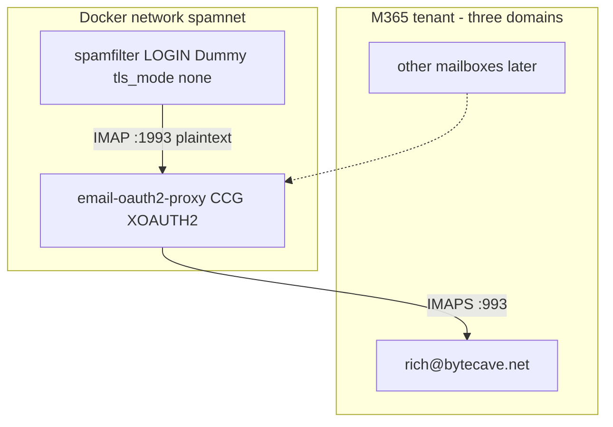

<!--
  ARCHIVE METADATA (prepended for chronological review; not in original source)
  Created:        2026-08-27 08:28:08 -0700
  Last modified:  2026-08-27 10:19:42 -0700
  Created source: filesystem birth/mtime
  Category:       cursor-plans
  Original name:  oauth_proxy_poc_4d76b018.plan.md
  Archive name:   12__2026-08-27_082808__oauth_proxy_poc_4d76b018.plan.md
  Source path:    /home/bytecave/.cursor/plans/oauth_proxy_poc_4d76b018.plan.md
  Notes:          Cursor plan; not in git. Timestamp from file birth time when available, else mtime.
-->

> **Created:** 2026-08-27 08:28:08 -0700  
> **Last modified:** 2026-08-27 10:19:42 -0700  
> **Original filename:** `oauth_proxy_poc_4d76b018.plan.md`  
> **Source:** `/home/bytecave/.cursor/plans/oauth_proxy_poc_4d76b018.plan.md`

---
---
name: OAuth proxy PoC
overview: Stand up email-oauth2-proxy as a separate Docker service on spamnet, register one Entra app for the whole M365 tenant (mailbox grants start with rich@bytecave.net only), then point imap-spamfilter at the proxy for a shadow PoC. Gmail and live.com come after that mailbox works.
todos:
  - id: entra-checklist
    content: "Entra+Exchange PoC ready: IMAP.AccessAsApp admin consent, tenant ID + client secret on hand, SP + FullAccess on rich@bytecave.net, ImapEnabled."
    status: completed
  - id: proxy-docker
    content: Add Dockerfile, example config, gitignored runtime config+cache, compose on external spamnet (no public 1993)
    status: completed
  - id: verify-login
    content: Prove IMAP LOGIN rich@bytecave.net Dummy against the proxy before touching the filter
    status: completed
  - id: accounts-yml
    content: Point accounts.yml at email-oauth2-proxy:1993 with tls_mode none + allow_insecure_tls; update accounts.yml.example
    status: completed
  - id: shadow-poc
    content: Restart spamfilter, confirm shadow scan/IDLE for that one mailbox
    status: completed
  - id: handoff
    content: Update SESSION_HANDOFF.md with proxy paths and mailbox-expansion notes
    status: completed
isProject: false
---

# OAuth proxy PoC: one M365 mailbox

## Order of work (this is the answer)

Do **not** start by filling real credentials into [accounts.yml](imap-spamfilter/accounts.yml). The filter only speaks IMAP `LOGIN`. OAuth lives in **email-oauth2-proxy**. Sequence:

1. **You (Entra + Exchange):** one tenant-wide app; grant IMAP only to `rich@bytecave.net` for now.
2. **This session:** Dockerize the already-cloned proxy, join `spamnet`, write a CCG config for that mailbox.
3. **Then:** point spamfilter `accounts.yml` at the proxy and run **one** account in `shadow`.
4. **Later (not today):** remaining tenant mailboxes, personal Gmail, live.com.

Two containers, same Docker network. Already decided in [SESSION_HANDOFF.md](imap-spamfilter/SESSION_HANDOFF.md). Upstream proxy has **no Dockerfile**; we add a thin one.

## Fork vs clone (decision: keep the clone)

A plain clone of `simonrob/email-oauth2-proxy` is the right starting point. **Do not fork unless we need to change `emailproxy.py` itself.**

| What we change | Where it lives | Needs a GitHub fork? |
|---|---|---|
| Dockerfile, compose, ByteLord paths | Local overlay + `/opt/bytelord/compose/...` | No |
| `emailproxy.config` / secrets / token cache | `/opt/bytelord/data/...` + secrets (never upstream) | No |
| Patches to proxy Python (bugs, IDLE quirks, missing CCG behavior) | Fork under `bytecave/email-oauth2-proxy`, `upstream` remote, PR when possible | Yes |

Reasons to stay on the clone for now:

- The whole point of the proxy architecture is to **avoid owning OAuth code**. Forking “just in case” recreates the maintenance burden we deliberately skipped for imap-spamfilter.
- Deployment artifacts (Docker, compose, example config) are ByteLord ops, not upstream product. They can sit beside the clone or as untracked/local files; pinning a release tag/commit is enough for reproducibility.
- If a real code fix becomes necessary later, converting clone → fork is cheap: create the fork on GitHub, `git remote rename origin upstream`, add `origin` = your fork, push the branch. Nothing about today’s PoC depends on that existing first.

Optional later hygiene (not a blocker): add `upstream` remote naming if missing, and pin the image build to a specific upstream commit/tag so `docker compose build` does not silently float.



## Entra / Exchange (you do this once; it scales)

Register **one** app for the whole small-business tenant. bytecave.net, eizenhoefer.net, and rjmetalfab.com all sit in that tenant, so they share this app. Extra mailboxes later are `Add-MailboxPermission` plus two config lines — not a new app.

Follow Microsoft’s current guide: [Authenticate an IMAP, POP or SMTP connection using OAuth](https://learn.microsoft.com/en-us/exchange/client-developer/legacy-protocols/how-to-authenticate-an-imap-pop-smtp-application-by-using-oauth).

1. Entra admin center → **App registrations** → New (single-tenant). Name e.g. `ByteCave IMAP Spam Filter`.
2. **Certificates & secrets** → client secret (PoC). Certificate auth can replace this later; not required for the first mailbox.
3. **API permissions** → **APIs my organization uses** → **Office 365 Exchange Online** → **Application** → `IMAP.AccessAsApp` only. Grant **admin consent**. Do not use delegated `IMAP.AccessAsUser.All` for this flow.
4. Copy these IDs (three different GUIDs — easy to mix up):

| What | Where in Entra | Used for |
|---|---|---|
| **Application (client) ID** | App registrations → your app → Overview | `New-ServicePrincipal -AppId`; also proxy `client_id` |
| **Directory (tenant) ID** | Same Overview page (or Entra overview) | proxy `token_url` |
| **Enterprise application Object ID** | **Enterprise applications** (not App registrations) → same app name → Overview → **Object ID** | `New-ServicePrincipal -ObjectId` |
| client secret | App registrations → Certificates & secrets | proxy `client_secret` |

**Do not** use the Object ID from the **App registrations** Overview page for `-ObjectId`. That is a different GUID and causes auth failures.

5. Install **Exchange Online PowerShell** on a Windows machine (one-time), then connect as a **tenant admin** (Global Admin or an account that can manage Exchange Online / mailbox permissions).

**Preferred:** PowerShell 7 (`pwsh` from https://aka.ms/powershell). It avoids several Windows PowerShell 5.1 PackageManagement quirks.

```powershell
# In pwsh (or Windows PowerShell 5.1):
Set-ExecutionPolicy -Scope CurrentUser RemoteSigned
Install-PackageProvider -Name NuGet -MinimumVersion 2.8.5.201 -Force -Scope CurrentUser
Install-Module -Name ExchangeOnlineManagement -Scope CurrentUser -Force -AllowClobber
Import-Module ExchangeOnlineManagement
Get-Command Connect-ExchangeOnline
Connect-ExchangeOnline   # browser MFA as tenant admin
```

If NuGet prompts “install provider now?”, answer **Y**. If you see `CommandAlreadyAvailable` / `PackageManagement` override errors, that means the NuGet bootstrap failed and **ExchangeOnlineManagement was never installed** — rerun with `-AllowClobber` as above (or switch to `pwsh`). Confirm with `Get-Module -ListAvailable ExchangeOnlineManagement` before `Import-Module`.

Then register the service principal and grant the PoC mailbox:

```powershell
Connect-ExchangeOnline
New-ServicePrincipal -AppId "<APPLICATION_ID>" -ObjectId "<ENTERPRISE_APP_OBJECT_ID>" -DisplayName "ByteCave IMAP Spam Filter"

# Assign to $sp (piping alone only prints — it does not set $sp):
$sp = Get-ServicePrincipal | Where-Object { $_.AppId -eq "<APPLICATION_ID>" }
$sp | Format-List DisplayName, Identity, ObjectId, AppId
# If Identity is empty, use ObjectId instead:
Add-MailboxPermission -Identity "rich@bytecave.net" -User $sp.ObjectId -AccessRights FullAccess
# Or with Identity when present:
# Add-MailboxPermission -Identity "rich@bytecave.net" -User $sp.Identity -AccessRights FullAccess
Get-CASMailbox -Identity "rich@bytecave.net" | Format-List ImapEnabled
```

If `$sp` is null / `-User` is null, you forgot the `$sp =` assignment (a bare `Get-ServicePrincipal | Where-Object ...` only displays). Re-run with `$sp = ...` first. For your app, ObjectId from that listing is also fine as `-User` (e.g. `8b29c420-...`).

PoC grant: **only** `rich@bytecave.net`. Do not org-wide grant. When adding later mailboxes (any of the three domains), repeat `Add-MailboxPermission` for that address. IMAP must stay enabled on those mailboxes.

**Status (2026-08-27):** Entra+Exchange PoC prerequisites **complete** — admin consent on `IMAP.AccessAsApp`, tenant ID + client secret available to the operator, service principal exists, FullAccess on `rich@bytecave.net`, `ImapEnabled: True`. Next: proxy Docker on `spamnet` (await explicit execute).

Token endpoint will be tenant-specific: `https://login.microsoftonline.com/<TENANT_ID>/oauth2/v2.0/token` with scope `https://outlook.office365.com/.default`. That is what the proxy sample CCG block uses.

## Proxy Docker (this session)

Upstream is already at `/opt/bytelord/projects/email-oauth2-proxy` (no compose yet). Add:

- [email-oauth2-proxy/Dockerfile](email-oauth2-proxy/Dockerfile) — Python slim, `requirements-core.txt` only, run `emailproxy.py --no-gui`.
- [email-oauth2-proxy/emailproxy.config.example](email-oauth2-proxy/emailproxy.config.example) — tracked, no secrets.
- Runtime config (gitignored / mode 640): `/opt/bytelord/data/email-oauth2-proxy/emailproxy.config` plus a separate `--cache-store` file so tokens are not mixed into the example.
- Compose: `/opt/bytelord/compose/email-oauth2-proxy/compose.yaml`, source also copied into the proxy repo (same pattern as [deploy/bytelord-compose.yaml](imap-spamfilter/deploy/bytelord-compose.yaml)). Join **external** network `spamnet`. **Do not publish 1993 on `0.0.0.0`.** Optional debug publish: `127.0.0.1:1993:1993`.

Critical vs the upstream sample: inside Docker, `local_address` must be `0.0.0.0` (or omitted), **not** `127.0.0.1`. Binding 127.0.0.1 inside the container would hide the port from spamfilter.

PoC server + account (IMAP only; skip POP/SMTP):

```ini
[IMAP-1993]
server_address = outlook.office365.com
server_port = 993
local_address = 0.0.0.0

[rich@bytecave.net]
token_url = https://login.microsoftonline.com/<TENANT_ID>/oauth2/v2.0/token
oauth2_scope = https://outlook.office365.com/.default
oauth2_flow = client_credentials
client_id = <APPLICATION_ID>
client_secret = <SECRET>

[emailproxy]
delete_account_token_on_password_error = False
encrypt_client_secret_on_first_use = True
allow_catch_all_accounts = False
```

**No catch-all for CCG.** Catch-all plus client credentials has almost no local access control (upstream warning). List each mailbox explicitly as we add them. Same `client_id` / `client_secret` on every M365 account section is fine.

CCG is headless: no browser, no MFA, no `--external-auth`. After the first successful LOGIN, the proxy encrypts the secret with the local IMAP password (`Dummy`).

## Spamfilter accounts.yml (after proxy LOGIN works)

Slice 4: `tls_mode: none` is refused unless the host is loopback **or** `allow_insecure_tls: true`. Docker DNS name `email-oauth2-proxy` is **not** loopback, so the PoC account must set `allow_insecure_tls: true`. That is plaintext only on `spamnet`, not the public internet.

```yaml
accounts:
  - name: rich_bytecave
    imap_host: email-oauth2-proxy
    imap_port: 1993
    tls_mode: none
    allow_insecure_tls: true
    user: rich@bytecave.net
    password: "Dummy"
    mode: shadow
```

Keep other placeholder accounts commented or omitted so the filter does not try dead hosts.

Update [accounts.yml.example](imap-spamfilter/accounts.yml.example) with this proxy pattern so the next mailbox copy-paste is obvious.

## Verify, then run

1. Start proxy compose; confirm it is on `spamnet` and listening on 1993.
2. From the **spamfilter** container (or host via `127.0.0.1:1993` if published): IMAP `LOGIN rich@bytecave.net Dummy` → `OK`. Failures here are Entra/Exchange, not the filter.
3. Recreate/restart `spamfilter` so it reloads [accounts.yml](imap-spamfilter/accounts.yml). Logs: connect, folder discovery, shadow scan, **no** Inbox/Junk writes.
4. Leave it running long enough to see IDLE + a token refresh (tokens last ~1h). That is the remaining risk called out in the design notes.

## Later (do not do today)

- **More M365 mailboxes:** `Add-MailboxPermission` for that address → new `[user@domain]` CCG block (same tenant URLs/ids) → new `accounts.yml` entry, still `shadow`.
- **Personal Gmail:** different proxy port `[IMAP-2993]` → `imap.gmail.com:993`. Delegated OAuth (not app-only). First auth needs `--external-auth` or `--local-server-auth` once per mailbox, then refresh tokens. Same Dummy LOGIN from the filter.
- **live.com / personal Outlook:** same `[IMAP-1993]` as M365 (outlook.office365.com) but **not** CCG. Per-account authorization code or `oauth2_flow = device`. Separate Entra public-client registration (or reused desktop client id); tenant CCG will not work for consumer mailboxes.

## Docs / secrets hygiene

- Secrets stay under `/opt/bytelord/secrets/` or mode-640 data files; never commit `emailproxy.config` with ids/secrets or real `accounts.yml`.
- After the PoC works, update [SESSION_HANDOFF.md](imap-spamfilter/SESSION_HANDOFF.md) with compose paths, the `allow_insecure_tls` Docker-DNS requirement, and the Entra mailbox-expansion steps.
- `graphify update .` after code/doc edits in imap-spamfilter.
