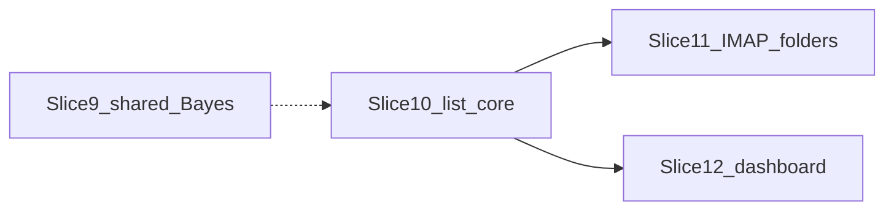

<!--
  ARCHIVE METADATA (prepended for chronological review; not in original source)
  Created:        2026-09-04 01:57:29 -0700
  Last modified:  2026-09-04 02:05:29 -0700
  Created source: filesystem birth/mtime
  Category:       cursor-plans
  Original name:  allow_block_arch_2b8d82b8.plan.md
  Archive name:   16__2026-09-04_015729__allow_block_arch_2b8d82b8.plan.md
  Source path:    /home/bytecave/.cursor/plans/allow_block_arch_2b8d82b8.plan.md
  Notes:          Cursor plan; not in git. Timestamp from file birth time when available, else mtime.
-->

> **Created:** 2026-09-04 01:57:29 -0700  
> **Last modified:** 2026-09-04 02:05:29 -0700  
> **Original filename:** `allow_block_arch_2b8d82b8.plan.md`  
> **Source:** `/home/bytecave/.cursor/plans/allow_block_arch_2b8d82b8.plan.md`

---
---
name: Allow Block Arch
overview: Write five design-arch documents (one parent index plus slices 9–12) that lock the agreed allow/block and shared-Bayes design so implementation can follow them slice-by-slice without re-litigating product decisions.
todos:
  - id: write-parent-index
    content: Write design-arch/allow_block_sliced_plan.md with locked decisions, mermaid deps, and later/out-of-scope ops
    status: completed
  - id: write-slice9
    content: Write design-arch/slice9_shared_bayes.md (shared bayes_user, no Redis merge, Trained-* re-feed note)
    status: completed
  - id: write-slice10
    content: Write design-arch/slice10_list_core.md (YAML roster, schema, parser, match, scan_inbox hook, tests)
    status: completed
  - id: write-slice11
    content: Write design-arch/slice11_imap_list_folders.md (INBOX children, drain, flip, MOVE back, shadow hybrid)
    status: completed
  - id: write-slice12
    content: Write design-arch/slice12_dashboard_lists.md (admin UI, CSRF, rw DB, CSP script-src self, Save rules)
    status: completed
  - id: point-requirements
    content: Point new_requirements.md at the new slices as authoritative for implementation
    status: completed
isProject: false
---

# Allow/block lists — architecture documents

Write the specs only (no filter/dashboard code). Match the voice and structure of existing slices such as [`design-arch/slice6_rspamd_scan_metadata.md`](design-arch/slice6_rspamd_scan_metadata.md): status, parent, depends-on, primary files, tests, locked behavior, non-goals, acceptance.

## Files to create

- [`design-arch/allow_block_sliced_plan.md`](design-arch/allow_block_sliced_plan.md) — index, locked product decisions, dependency graph, what is explicitly later (Caddy/`spam.bytelord.net`, Trained-* re-feed).
- [`design-arch/slice9_shared_bayes.md`](design-arch/slice9_shared_bayes.md)
- [`design-arch/slice10_list_core.md`](design-arch/slice10_list_core.md)
- [`design-arch/slice11_imap_list_folders.md`](design-arch/slice11_imap_list_folders.md)
- [`design-arch/slice12_dashboard_lists.md`](design-arch/slice12_dashboard_lists.md)

Also update [`new_requirements.md`](new_requirements.md) status line to point at these specs (requirements remain historical; slices are authoritative).



Slice 9 is independent of lists and should ship first. Slices 11 and 12 both depend on 10 and can overlap after 10. Caddy/Netbird hostname is **not** a slice.

---

## Locked product decisions (copy into the parent index)

These are closed. Specs must not reopen them.

- **Override:** still scan and log rspamd score; lists only override keep/flag/move. No Bayes learn from a list hit.
- **Headers at scan:** From, Sender, and Reply-To. **IMAP drag writes From only.**
- **Conflicts:** person address beats domain address beats whole-domain `@host`. Same specificity → **allow** wins. Log `list_conflict` when allow and block both match at the winning specificity.
- **Person lists:** keyed by required `actual_name`; apply to every account with that string. Addresses only.
- **Domain lists:** one allow and one block per YAML roster domain; addresses and `@domain` / `domain`. Dashboard cannot add/remove domains.
- **Roster:** `bytecave.net` company, `eizenhoefer.net` personal, `rjmetalfab.com` company, `bytelord.net` company. `company` vs `personal` is **metadata only** in v1 (dropdown grouping/label). Matching is the same for both.
- **YAML vs SQLite:** YAML names domains + `actual_name` + Bayes/caps. SQLite holds every list row.
- **After IMAP drag:** upsert person-list row, MOVE message back to Inbox. Drag to the other folder flips allow ↔ block. Shadow may CREATE list folders, drain, and MOVE-back-to-Inbox; still no automatic Junk/Trash.
- **Inbox scan only:** list override is not applied on Junk poll (no “pull out of Junk because allowlisted” in v1).
- **Caps:** `max_list_per_run` default 100; `max_list_entries` default 1000 per `(scope_type, scope_key, kind)`.
- **Dashboard v1:** existing session login, **admin only**, no OAuth2. Two tabs (Domain | User). Per tab: dropdown, Allow|Block toggle, one textarea, find-in-text search that does **not** hide lines, Save/Cancel enabled only when dirty, warn on dropdown/toggle/tab/browser leave.
- **Save:** trim lines, skip blanks, reject internal whitespace and invalid syntax with cursor on first bad line, collapse case-insensitive dupes, replace that list in a transaction, **remove the pattern from the sibling list** (IMAP flip semantics).
- **Bayes:** one VPS notebook via shared `bayes_user` (e.g. `bytelord`). Fresh notebook; no Redis merge. Re-feed later with existing [`filter/bootstrap_train.py`](filter/bootstrap_train.py) against Trained-* (note only; not slice 9 code).
- **Case:** store and match patterns lowercased.

---

## Slice 9 — One VPS Bayes

**Goal:** Every ByteLord account shares one rspamd Bayes identity. Leave `users_enabled = true` in [`rspamd/local.d/classifier-bayes.conf`](rspamd/local.d/classifier-bayes.conf).

**Do not** change the builtin `bayes_user: None` in [`filter/filter.py`](filter/filter.py) `BUILTIN_DEFAULTS` (other deployments stay per-mailbox). ByteLord sets it in gitignored `accounts.yml` `defaults:`.

**Code/docs:**

- Document in [`README.md`](README.md) Bayes section and [`accounts.yml.example`](accounts.yml.example): shared `defaults.bayes_user: bytelord` (or any stable token without CR/LF); switching identity **orphans** old Redis keys; `min_learns` is per notebook so the shared book must reach 200 again unless re-fed.
- Follow-up subsection (not implemented here): after cutover, `docker exec spamfilter python bootstrap_train.py <account> <Trained-Spam IMAP name> spam` and the ham equivalent **without** `--move-to`, so mail stays in Trained-*. Warn: do this **after** `bayes_user` is set; while still in `shadow` retention will not eat Trained-*. Alternative: MOVE Trained-* → Train-* and let drain run (`max_train_per_run` 5000). No new app.
- Live VPS: set `defaults.bayes_user` on `/opt/bytelord/projects/imap-spamfilter/accounts.yml` (or compose-mounted copy) and restart `spamfilter`. Confirm logs show one Rcpt identity (existing `rspamd_scan` already uses `acc.bayes_user or acc.user`).

**Tests:** none required beyond existing `test_rspamd_scan.py` / `_clean_bayes_user` unless example YAML in tests needs the new comment shape.

**Acceptance:** example + README describe one-notebook cutover and Trained-* re-feed; live accounts share one `bayes_user`; classifier config unchanged.

---

## Slice 10 — List core (schema, YAML, matching, scan)

**Primary:** [`filter/filter.py`](filter/filter.py). **Tests:** new `filter/test_address_lists.py` (pure matching + loader + DB; no IMAP).

### YAML

Extend `ROOT_CONFIG_KEYS` with `list_domains` (root, **not** copied onto each `Account`):

```yaml
list_domains:
  - domain: bytecave.net
    type: company
  - domain: eizenhoefer.net
    type: personal
  - domain: rjmetalfab.com
    type: company
  - domain: bytelord.net
    type: company
```

Loader rules: list of maps; `domain` required, stored lowercased, unique; `type` in `company|personal`; reject unknown keys. Empty/omitted `list_domains` → no domain-scoped lists (person lists still work).

Per-account **required** `actual_name` (add to `REQUIRED_PER_ACCOUNT`). Strip; reject empty, CR/LF. Exact string is the person-list key (do not lowercase the display name). Same `actual_name` on multiple accounts is required (Rich’s three mailboxes).

New account/default ints: `max_list_per_run` (1..5000, default 100), `max_list_entries` (1..10000, default 1000). Add to `BUILTIN_DEFAULTS`, `ACCOUNT_CONFIG_KEYS`, `Account`, `validate_account`.

Mailbox domain for domain-list lookup = lowercase domain of `acc.user` (the IMAP user). If that domain is not on the roster, skip domain-list lookup.

Keep a process-level `ListRoster` (or fields on a small config object) loaded once in `load_accounts`: roster domains + types, plus each `Account.actual_name`.

### Schema

New table in `SCHEMA_TABLES` + `CREATE INDEX` on `(scope_type, scope_key, kind, pattern)`:

- `scope_type`: `person` | `domain`
- `scope_key`: `actual_name` or lowercase domain
- `kind`: `allow` | `block`
- `pattern`: normalized lowercase (`user@host` or `@host`)
- `pattern_type`: `address` | `domain`
- `source`: `imap` | `dashboard`
- `actor`, `sample_message_id` nullable
- `created_at`, `updated_at`
- `UNIQUE(scope_type, scope_key, kind, pattern)`

Empty on upgrade (`_migrate` only `CREATE TABLE IF NOT EXISTS`). No M365 import.

`Db` helpers: `list_get`, `list_replace` (dashboard), `list_upsert_address`, `list_flip_address`, `list_count`, `list_delete_sibling`. `log_event` stays per-account; list hits use the scanning account’s `Db`.

### Pattern syntax (shared parser)

Used by scan, IMAP drain, and dashboard Save:

- Trim; skip empty lines.
- Internal whitespace → invalid.
- Lowercase for storage/match.
- Address: one `@`, non-empty local and host, no spaces → `pattern_type=address`, pattern `local@host`.
- Domain (domain lists only): `@host` or `host` (no extra `@`) → `pattern_type=domain`, pattern `@host`.
- Person lists: domain patterns are invalid.
- No wildcards in v1.

### Header extraction and match

New helpers (do not overload `parse_envelope`’s From-only sender):

- `iter_list_header_addrs(raw) -> list[str]` — parseaddr on From, Sender, Reply-To; drop empties; lowercase; unique preserve order.
- `classify_list_hit(acc, roster, db, addrs) -> None | {decision, pattern, scope, conflict}`.

Specificity rank: person+address = 3, domain+address = 2, domain+`@host` = 1. Collect all hits across **all** extracted addrs. Winner = max rank; if any allow at that rank → allow, else block. If both kinds present at that rank → `conflict=True` still allow.

Scan still runs `rspamd_scan` first (route-only). Then classify:

- **allow:** log `[shadow]/info allowlist hit`; `our_action=allowlisted`; event `allowlisted`; **skip** threshold flag/move even if score ≥ threshold. Bookmark advances (terminal).
- **block:** treat as ≥ threshold regardless of score; log `blocklist hit`; `our_action` follows mode (`blocklisted_shadow` / flag / pending_move as today); event `blocklisted`. Shadow still does not MOVE to Junk.
- **no hit:** existing threshold path unchanged.

Do not apply this in `poll_junk`.

### Tests (slice 10)

Loader: missing `actual_name` exits; `list_domains` types; unknown root key rejected. Parser: trim, internal space, person rejects `@x.com`, domain accepts `x.com` and `@x.com`. Match matrix: person allow vs domain block; domain `@host` vs person address; From vs Reply-To (scan uses all three; a Reply-To-only allow still hits). Scan fake IMAP: over-threshold + allow stays; under-threshold + block acts. Shadow block does not MOVE.

---

## Slice 11 — IMAP folder gestures

**Depends on 10.** Primary: [`filter/filter.py`](filter/filter.py) `ensure_folders`, `build_folder_map`, `_run_account`. Tests: `filter/test_list_folders.py` (FakeIMAP, same style as [`filter/test_shadow_mode.py`](filter/test_shadow_mode.py)).

### Folders

English names under IMAP Inbox (not under Junk, not SPECIAL-USE):

- Config defaults: `allowlist: INBOX/Allowlist`, `blocklist: INBOX/Blocklist` (delimiter-rewritten like Train-* via `resolve_folder`).
- `AUTO_CREATE` add `allowlist` and `blocklist` (filter-owned; **allowed in shadow**, same hybrid contract as Train-*).
- Inbox/Junk/Trash remain REQUIRED and never auto-created.

### Drain

New `_drain_list_folder(..., kind=allow|block)` modeled on `_drain_train_folder`:

- SELECT list folder writable; `SEARCH ALL`; cap `max_list_per_run` (100).
- FETCH body; **From only** via existing `parse_envelope` sender (ignore Sender/Reply-To for the written row).
- If From empty: log, still MOVE back to Inbox (do not lose mail).
- `list_upsert_address` / `list_flip_address` for `(person, actual_name)`. Never write `pattern_type=domain` from IMAP.
- If `list_count >= max_list_entries` and pattern is new: do not add; log `list_cap`; still MOVE to Inbox.
- On success: MOVE UIDs to `fmap["inbox"]` (source selected; shadow Inbox may stay EXAMINE).
- Flip: if pattern exists on the other kind for that person, delete sibling and insert (event `list_flip`); else insert (event `list_imap_add`).

Call site in `_run_account`: after Train-* drains, drain allowlist then blocklist, **then** `scan_inbox` so a same-loop new Inbox UID can apply block immediately.

### Tests

Shadow CREATE of list folders, no Junk/Trash CREATE. Drain From `a@x.com` inserts person allow, MOVE to Inbox. Second drain into Blocklist flips. Oversize/empty From still leaves the list folder. Cap 100 stops adds but clears the folder via MOVE. Domain pattern not created from IMAP.

---

## Slice 12 — Dashboard list UI

**Depends on 10.** Primary: [`filter/dashboard.py`](filter/dashboard.py), new [`filter/lists.js`](filter/lists.js) (or equivalent static file next to `favicon.png`). Tests: extend [`filter/test_dashboard.py`](filter/test_dashboard.py).

### Authz and writes

- Nav links **Domain lists** / **User lists** only if `is_admin`. Non-admin GET → 403. POSTs admin-only.
- Existing session login stays; no OAuth2. CSRF: token in session, hidden field on Save, reject mismatch.
- Keep `_db()` read-only for existing pages. Add `_db_rw()` **only** for list GET/POST (WAL + timeout). `MAX_CONTENT_LENGTH` is 16 KiB today ([`LOGIN_REQUEST_MAX`](filter/dashboard.py)); list Save of up to 1000 lines needs a higher limit on those routes (e.g. 256 KiB) without loosening login.
- Footer: stop claiming the whole app is read-only (today `BASE` says `read-only`).

### CSP / JS (required for the agreed UX)

Slice 8 CSP is `default-src 'none'` with **no `script-src`**, so `beforeunload`, dirty tracking, search, and cursor-on-error cannot work. Slice 12 **must** add `script-src 'self'` and serve one static JS file (do **not** use `'unsafe-inline'` for scripts). Keep `style-src 'unsafe-inline'`. Document the CSP delta in the slice.

JS behavior:

- Save/Cancel disabled until textarea ≠ loaded snapshot.
- Changing domain/user dropdown, Allow|Block toggle, or tab: if dirty, `confirm` and stay.
- `beforeunload` when dirty.
- Search: do **not** remove lines; jump/select first matching line; show match count or “no matches”; (x) clears query only.
- On validation error response: place caret on `error_line` (1-based).

### Page chrome (both tabs)

Fixed (non-scrolling) header: dropdown, Allow | Block toggle, Save, Cancel. Scrollable textarea below. Domain tab dropdown = roster domains (label may show company/personal). User tab dropdown = distinct `actual_name` sorted A–Z (from loaded accounts.yml, not from SQLite). Selecting a roster domain with no rows → empty textarea. `bytelord.net` appears even with zero mailboxes.

GET loads current SQLite list as one pattern per line. POST body = full textarea for that `(scope, kind)` only. Server runs the slice-10 parser; on first error return 400 + line number + message, **no writes**. Success: replace rows for that scope+kind; sibling delete; events `list_dashboard_save`; redirect/re-render clean.

Person Save: reject domain patterns. Domain Save: allow both.

### Tests

Admin can GET/POST; non-admin 403. CSRF missing rejected. Invalid line no persist. Sibling removed on Save. Scope/kind cannot be forged to a domain not on the roster (404). Optional: JS not unit-tested beyond page containing `lists.js`.

---

## Implementation notes for whoever writes the markdown

- Cite live symbols: `Account` (~L154), `load_accounts` (~L497), `SCHEMA_TABLES` (~L744), `scan_inbox` (~L1981), `ensure_folders` (~L1491), `_run_account` (~L2775), `parse_envelope` (~L1612), dashboard `_db` (~L476), `BASE` nav (~L785), CSP (~L335).
- Parent index includes a “not in these slices” list: Caddy `spam.bytelord.net`, Netbird, OAuth2, Junk un-junk from allowlist, wildcards, M365 safe-senders import, Redis Bayes merge, non-admin dashboard users.
- After the five files exist, run `graphify update .` so the graph picks up the new specs (docs-only; no API cost).
