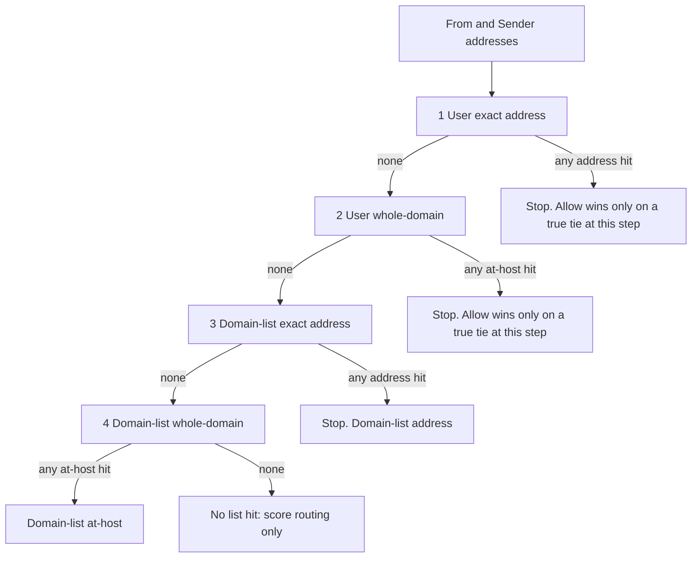

<!--
  ARCHIVE METADATA (prepended for chronological review; not in original source)
  Created:        2026-09-05 22:58:10 -0700
  Last modified:  2026-09-05 23:41:03 -0700
  Created source: filesystem birth/mtime
  Category:       cursor-plans
  Original name:  user_list_overrides_8a393526.plan.md
  Archive name:   23__2026-09-05_225810__user_list_overrides_8a393526.plan.md
  Source path:    /home/bytecave/.cursor/plans/user_list_overrides_8a393526.plan.md
  Notes:          Cursor plan; not in git. Timestamp from file birth time when available, else mtime.
-->

> **Created:** 2026-09-05 22:58:10 -0700  
> **Last modified:** 2026-09-05 23:41:03 -0700  
> **Original filename:** `user_list_overrides_8a393526.plan.md`  
> **Source:** `/home/bytecave/.cursor/plans/user_list_overrides_8a393526.plan.md`

---
---
name: User list overrides
overview: Drop Reply-To from allow/block matching (From + Sender only), let user lists store `@host` as well as addresses, and make any user-list hit override the roster-scoped domain list.
todos:
  - id: headers-from-sender
    content: Drop Reply-To from iter_list_header_addrs; retarget tests to From+Sender only
    status: completed
  - id: person-domain-patterns
    content: Allow @host on user lists (dashboard + parser); IMAP drag stays From address only
    status: completed
  - id: scope-first-matcher
    content: "Rewrite classify_list_hit as four stop-on-first-hit steps: user address, user @host, domain-list address, domain-list @host; allow wins only on a true tie at the winning step"
    status: completed
  - id: tests-docs
    content: Add override/specificity/Reply-To tests; update status + slice docs; un-lock policy language
    status: completed
  - id: verify-commit
    content: Run filter pytest in Docker, graphify update, commit and push
    status: completed
isProject: false
---

# User lists override domain lists; drop Reply-To

Policy is reopenable whenever you ask. “Locked / do not reopen” in [IMPLEMENTATION_STATUS.md](IMPLEMENTATION_STATUS.md) and [design-arch/allow_block_sliced_plan.md](design-arch/allow_block_sliced_plan.md) is incorrect and will be removed as part of this work.

Git is already clean on `origin/main` (`441b951`). Commit and push after this change.

## Terminology

- **User list** (`scope_type=person`, key = `actual_name`): shared across that person’s mailboxes. **Today addresses only; this change adds `@host` / bare host.**
- **Domain list** (`scope_type=domain`, key = a `list_domains` roster entry such as `rjmetalfab.com`): shared by every mailbox whose IMAP user domain is on that roster. Already holds **addresses and `@host`**. Not “a list of domain names only.”

IMAP drag stays **From address only** (never a whole-domain pattern from a folder gesture).

## Change 1 — Scan From + Sender only

[filter/filter.py](filter/filter.py) `iter_list_header_addrs` currently walks `From`, `Sender`, `Reply-To`. Remove `Reply-To` (spoofable). Docstring and all specs/status/README that say three headers follow.

[filter/test_address_lists.py](filter/test_address_lists.py) `test_match_reply_to_only` becomes a negative test: Reply-To-only allow does **not** hit when From/Sender differ. Add a Sender-only positive test if one is missing.

## Change 2 — User lists may include whole domains, and they override domain lists

This does **not** exist today. User-tab POST uses `allow_domain=False`; `parse_list_line` rejects `@x.com` on person lists; matcher never looks up person `@host`.



**Who wins on the same user list (confirmed):** more-specific **address** beats whole-domain `@host` / `vendor.com`. Allow wins **only** when allow and block both match at that same step (true tie).

- User allow `vendor.com` + user block `spam@vendor.com` → **block** (step 1 address beats step 2 `@host`).
- User block `vendor.com` + user allow `notspam@vendor.com` → **allow** (step 1 address beats step 2 `@host`).

**`list_conflict` is audit-only.** On a true tie (same pattern on both allow and block at the winning step), routing is still **allow** (keep in Inbox). The filter also writes an `events` row named `list_conflict` next to `allowlisted`. Nothing else branches on it: no different IMAP action, no Bayes, no safe-mode, no extra dashboard badge beyond the generic events table. Dashboard Save and IMAP flip already delete the sibling row, so a same-pattern tie is uncommon. Keep logging it; do not give it new behavior.

**From + Sender are pooled** before the walk. If either header hits step 1, steps 2–4 are skipped for that message.

**Today** this pair cannot exist on a user list (person lists reject `@host`). The same specificity rule already exists on a **domain list**: `test_match_domain_address_beats_domain_host` (domain-list address block beats domain-list `@host` allow).

**Matcher** (`classify_list_hit`): one decision per message. Collect From and Sender (not Reply-To), then walk the four steps below in order; stop at the first step that produced any hit. Do not mix a later step into that decision. Domain-list rows are never consulted if step 1 or 2 hit. True tie at the winning step: allow + `list_conflict` event (audit only).

1. User-list **exact address** (`spam@vendor.com`)
2. User-list **whole domain** (`vendor.com` / `@vendor.com`)
3. Domain-list **exact address** (roster-scoped list)
4. Domain-list **whole domain**

So a user’s `@vendor.com` allow (step 2) still overrides a roster domain-list block of `spam@vendor.com` (step 3): the user list matched, so the domain list is skipped. A user’s `notspam@vendor.com` (step 1) still beats that same user’s `@vendor.com` block (step 2).

Keep `ListHit.scope` / `pattern` / `conflict`. Rank can stay as a log field (person address=4, person host=3, domain address=2, domain host=1) or be dropped if it is no longer useful.

**Parser / dashboard:** User tab in [filter/dashboard.py](filter/dashboard.py) sets `allow_domain=True` (same as Domain tab). Hint becomes “One address or domain per line (user@host or @host).” Flip [filter/test_dashboard.py](filter/test_dashboard.py) `test_list_post_person_rejects_domain_pattern` to assert POST `@x.com` saves on the person list (200, stored as `@x.com`).

**IMAP drain:** unchanged — `_drain_list_folder` still `parse_list_line(sender, allow_domain=False)` and From-only.

## Tests to add or retarget

In [filter/test_address_lists.py](filter/test_address_lists.py):

- Person `@host` allow vs domain-list address block of that host → **allow**, no `list_conflict`
- Person `@host` block vs domain-list `@host` allow → **block**
- Person address allow vs person `@host` block → **allow** (step 1 beats step 2)
- Person `@host` allow vs person address block of that host → **block** (vendor.com allow vs spam@vendor.com block)
- Person address block vs domain-list address allow → **block** (already true; add the test)
- Reply-To-only no longer matches
- Existing person-address vs domain-list tests still pass

Parser: person path with `allow_domain=True` accepts `@x.com` / `x.com`. IMAP/person-drag path still rejects `@x.com`.

## Docs

Update the precedence/headers sections in [IMPLEMENTATION_STATUS.md](IMPLEMENTATION_STATUS.md), [design-arch/allow_block_sliced_plan.md](design-arch/allow_block_sliced_plan.md), [design-arch/slice10_list_core.md](design-arch/slice10_list_core.md), [design-arch/slice12_dashboard_lists.md](design-arch/slice12_dashboard_lists.md), and the README list notes. Status file also: policy is reopenable; git snapshot `441b951`.

Do not edit slice plan **status tables** beyond the policy/header text this change requires.

## Verify and ship

```bash
docker run --rm -v /opt/bytelord/projects/imap-spamfilter/filter:/app -w /app \
  python:3.12-slim bash -c \
  "pip install -q -r requirements.txt pytest==8.4.2 && python -m pytest -q --tb=short"
```

Then `graphify update .`, commit, and push (no `accounts.yml` / secrets). Rebuild the live `spamfilter` container only if you ask.