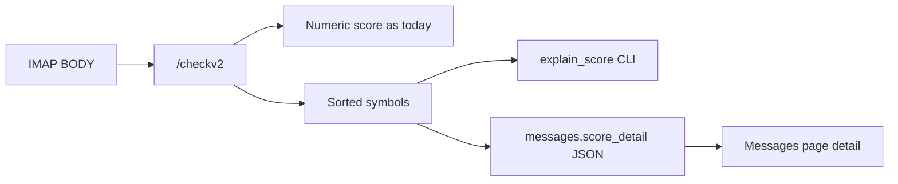

<!--
  ARCHIVE METADATA (prepended for chronological review; not in original source)
  Created:        2026-09-06 00:38:13 -0700
  Last modified:  2026-09-06 00:48:04 -0700
  Created source: filesystem birth/mtime
  Category:       cursor-plans
  Original name:  explain_high_scores_f295a03f.plan.md
  Archive name:   25__2026-09-06_003813__explain_high_scores_f295a03f.plan.md
  Source path:    /home/bytecave/.cursor/plans/explain_high_scores_f295a03f.plan.md
  Notes:          Cursor plan; not in git. Timestamp from file birth time when available, else mtime.
-->

> **Created:** 2026-09-06 00:38:13 -0700  
> **Last modified:** 2026-09-06 00:48:04 -0700  
> **Original filename:** `explain_high_scores_f295a03f.plan.md`  
> **Source:** `/home/bytecave/.cursor/plans/explain_high_scores_f295a03f.plan.md`

---
---
name: Explain high scores
overview: Amazon’s ~25 scores are driven by auth/header/MIME symbols on the IMAP scan path, not Bayes. Add a symbol-dump CLI and persist top scoring symbols so we can see this for every high score without re-fetching.
todos:
  - id: scan-detail
    content: Add rspamd_scan_detail + ScanResult; keep rspamd_scan wrapper
    status: completed
  - id: explain-cli
    content: Add explain_score.py CLI and Dockerfile COPY
    status: completed
  - id: persist-detail
    content: Persist score_detail on scan; log top symbols for high scores
    status: completed
  - id: dash-docs-ship
    content: Show top symbols on Messages page; tests + docs; commit/push
    status: completed
isProject: false
---

# Explain why high scores (esp. Amazon) happen

## What we already know (live sample)

Re-scanned `rich_bytecave` Inbox UID `234134` (`auto-confirm@amazon.com`, subject “Ordered 16 items…”) via the same `/checkv2` path the filter uses. Score **24.9**. Symbol contributions (Bayes **did not fire**):

| Score | Symbol | Meaning |
|---|---|---|
| 8.0 | `BROKEN_HEADERS` | Header structure looks broken |
| 6.0 | `BLACKLIST_DMARC` | Domain on rspamd’s allowlist but DMARC failed (`amazon.com:D:-`) |
| 2.5 | `HFILTER_HOSTNAME_UNKNOWN` | No usable client hostname |
| 2.0 | `RDNS_NONE` | No reverse DNS for “sender IP” |
| 1.5 | `DMARC_POLICY_QUARANTINE` | DMARC quarantine + “No valid SPF” |
| 1.0 each | `R_SPF_FAIL`, `R_DKIM_REJECT`, `ZERO_FONT`, `URI_COUNT_ODD`, `MANY_INVISIBLE_PARTS` | Auth fail + HTML quirks |

Also: `RBL_SPAMHAUS_BLOCKED_OPENRESOLVER` and `URIBL_BLOCKED` (RBLs not scoring; DNS/policy blocked). So training Amazon as ham cannot pull these scores down — those symbols ignore Bayes. IMAP has no SMTP client IP ([slice 6](design-arch/slice6_rspamd_scan_metadata.md)); SPF/DKIM/DMARC/hostname heuristics are degraded / misleading after M365 delivery.

Remediation (weights, local.d overrides, neural feedback) is a **follow-up** after instrumentation is in place. This plan is diagnose-first.

## Approach

Keep the live numeric score path. Add a detail path and make high scores explainable without guessing.



### 1. Parse `/checkv2` symbols in [`filter/filter.py`](filter/filter.py)

- Add `ScanResult(score, symbols: list[tuple[name, score, description]])` (or similar).
- Add `rspamd_scan_detail(...)` that returns `ScanResult | None` with symbols sorted by absolute score, dropping ~0-noise unless names start with `BAYES_`, `RBL_`, `DMARC_`, `SPF`, `NEURAL_`, `FUZZY_`, `DKIM_`, `ARC_`, `URIBL_`.
- Keep `rspamd_scan` as a thin wrapper returning only `score` so existing callers/tests stay stable.

### 2. CLI [`filter/explain_score.py`](filter/explain_score.py)

Inside the container:

```bash
docker exec spamfilter python explain_score.py rich_bytecave --uid 234134
docker exec spamfilter python explain_score.py rich_bytecave --message-id '<...>'
```

- Load account, SPECIAL-USE remap, fetch `BODY.PEEK[]` from Inbox (or `--folder`).
- Call `rspamd_scan_detail` with the same `From`/`Rcpt` headers as production.
- Print total score, action, then symbol table; explicitly print whether `BAYES_HAM` / `BAYES_SPAM` fired.
- Copy into the image in [`filter/Dockerfile`](filter/Dockerfile) next to `bootstrap_train.py`.

### 3. Persist top symbols on Inbox scan

- Add nullable `score_detail TEXT` on `messages` (migration in existing schema init / `ALTER` path like other columns).
- In `scan_inbox`, after a successful scan, store compact JSON of the top ~15 symbols (name + score + short description). Cap size (~2–4 KiB).
- Log one line for scores ≥ threshold / ≥ 15: top 5 symbol names and scores (so Amazon-class hits show up in `docker logs` without the CLI).

### 4. Dashboard

- On Messages ([`filter/dashboard.py`](filter/dashboard.py)), under Score (or a small “why” column), show a muted one-line summary of the top 3 contributing symbols when `score_detail` is present. Full JSON stays in DB for CLI/ops; no new page required.

### 5. Tests

- Extend [`filter/test_rspamd_scan.py`](filter/test_rspamd_scan.py): fake `/checkv2` with symbols → `rspamd_scan_detail` sorts and filters; `rspamd_scan` still returns float only.
- Small CLI unit test with mocked IMAP + scan (same style as `test_bootstrap_train.py`).

### 6. Docs / status

- README known-limitations: IMAP auth symbols can dominate; use `explain_score.py`.
- [`IMPLEMENTATION_STATUS.md`](IMPLEMENTATION_STATUS.md): Amazon sample finding + how to re-run the CLI.
- Commit/push; rebuild/deploy when you want it live (same as prior VPS workflow).

## Out of scope for this change

Changing rspamd weights, disabling `BLACKLIST_DMARC` / `BROKEN_HEADERS`, fixing Spamhaus open-resolver, or turning off neural. Those are the likely fixes once the CLI confirms the same pattern across more samples.