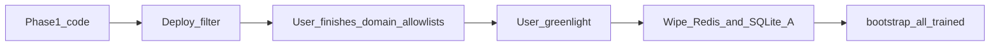

<!--
  ARCHIVE METADATA (prepended for chronological review; not in original source)
  Created:        2026-09-06 01:20:00 -0700
  Last modified:  2026-09-06 02:48:02 -0700
  Created source: filesystem birth/mtime
  Category:       cursor-plans
  Original name:  list_hits_vs_training_89b59683.plan.md
  Archive name:   26__2026-09-06_012000__list_hits_vs_training_89b59683.plan.md
  Source path:    /home/bytecave/.cursor/plans/list_hits_vs_training_89b59683.plan.md
  Notes:          Cursor plan; not in git. Timestamp from file birth time when available, else mtime.
-->

> **Created:** 2026-09-06 01:20:00 -0700  
> **Last modified:** 2026-09-06 02:48:02 -0700  
> **Original filename:** `list_hits_vs_training_89b59683.plan.md`  
> **Source:** `/home/bytecave/.cursor/plans/list_hits_vs_training_89b59683.plan.md`

---
---
name: List hits vs training
overview: "Phase 1 (coding, no wipe): skip /checkv2 on list hits; bootstrap writes Messages/events/Learned. Phase 2 (greenlight only, wipe A): DELETE messages + learn_* events, flush Redis/neural, then --all-trained."
todos:
  - id: phase1-list-skip
    content: Implement classify_list_hit before scan; skip /checkv2 on list hits; tests + docs
    status: completed
  - id: phase1-bootstrap-dash
    content: Extend bootstrap_train to upsert messages + log learn_spam/learn_ham into spamfilter.db
    status: completed
  - id: phase1-deploy
    content: Rebuild/restart spamfilter with Phase 1 (no wipe yet)
    status: completed
  - id: phase2-hold
    content: "HOLD for greenlight: wipe Redis Bayes/fuzzy/neural + rspamd cache; DELETE FROM messages + learn_* events (option A); then bootstrap --all-trained"
    status: completed
isProject: false
---

# List-skip scan, bootstrap logging, then wipe/retrain

**Wipe SQLite is option A (locked):** Phase 2 will `DELETE FROM messages` and delete `learn_ham` / `learn_spam` (and related learn) events. Bookmarks, allow/block lists, and safe_mode stay. **Do not run Phase 2 until greenlight.**

**Phase 1 is approved to code.** Implementation is blocked while this session is in Plan mode (Python edits rejected). Switch the chat to **Agent** to execute the steps below.

## Agreed order

1. Phase 1: list-skip + bootstrap dashboard logging + deploy filter. No corpus wipe.
2. User finishes domain allowlist edits.
3. Phase 2 only after explicit greenlight.




---

## Phase 1 — list-skip scan

In `[filter/filter.py](filter/filter.py)` `scan_inbox`, **after** FETCH / Junk-revert, **before** `rspamd_scan_detail`:

1. `classify_list_hit`
2. **Allow:** `our_action=allowlisted`, events, no `/checkv2`, leave `our_score` NULL unless a prior stored score exists (keep for audit, still do not re-scan)
3. **Block:** `over_threshold=True`, no `/checkv2`, then existing mode action (shadow/flag/move). Log `score=skipped` when there is no prior score
4. **Miss:** existing unseen gate + scan + threshold

Helpers: `_finite_score`, `_score_log`, `_list_hit_event_detail`. Action log lines that currently use `score=%.2f` must accept skipped.

Tests in `[filter/test_address_lists.py](filter/test_address_lists.py)`:

- Allow/block hits: `rspamd_scan_detail` is never called; no `scan` event; fresh allow has `our_score is None`
- Unlisted mail still scans
- Block still flags in `flag` mode / shadows in `shadow`

Docs: `[design-arch/allow_block_sliced_plan.md](design-arch/allow_block_sliced_plan.md)`, `[design-arch/slice10_list_core.md](design-arch/slice10_list_core.md)` §7, README, `[IMPLEMENTATION_STATUS.md](IMPLEMENTATION_STATUS.md)`. Policy becomes: lists override routing **and skip rspamd scan**. Train-* / Inbox↔Junk learns unchanged.

---

## Phase 1 — bootstrap dashboard logging

`[filter/bootstrap_train.py](filter/bootstrap_train.py)`:

- `init_db()` in `main`
- Open `Db(acc.name)` in one-account and `--all-trained` loops
- After `rspamd_learn` outcome `learned` or `already`: upsert Trained-* IMAP row, set `learned_as` / `learned_at`, `log_event("learn_ham"|"learn_spam", detail="bootstrap ...")`
- Dry-run / declined / failed: no learn event
- SELECT must provide `UIDVALIDITY` (FakeIMAP in tests returns `1`)

Tests in `[filter/test_bootstrap_train.py](filter/test_bootstrap_train.py)`: successful learn writes message + event; dry-run does not.

---

## Phase 1 — deploy

```bash
export SPAMFILTER_UID=1001 SPAMFILTER_GID=1001
docker compose -f /opt/bytelord/compose/imap-spamfilter/compose.yaml up -d --build spamfilter
```

No Redis flush, no SQLite wipe, no `--all-trained`.

---

## Phase 2 — HOLD (option A)

When greenlit (not now):

1. Wipe Redis Bayes/fuzzy/neural + rspamd `/var/lib/rspamd` neural cache
2. SQLite: `DELETE FROM messages;` plus delete `learn_ham` / `learn_spam` / related learn events
3. `docker exec spamfilter python bootstrap_train.py --all-trained`

Exact commands confirmed against live `/opt/bytelord/data/imap-spamfilter/` at execution time.

---

## Out of scope until asked

- IMAP-path symbol weight remediation for non-listed mail
- Blocking Train-* learn when sender is listed
- Commit/push
- Phase 2 execution

