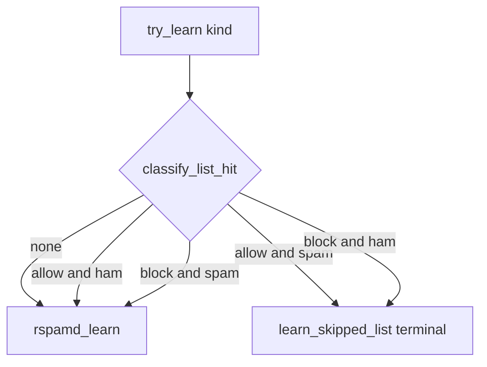

<!--
  ARCHIVE METADATA (prepended for chronological review; not in original source)
  Created:        2026-09-06 03:14:46 -0700
  Last modified:  2026-09-06 03:24:23 -0700
  Created source: filesystem birth/mtime
  Category:       cursor-plans
  Original name:  list-contradict_learn_skip_17f4c624.plan.md
  Archive name:   27__2026-09-06_031446__list-contradict_learn_skip_17f4c624.plan.md
  Source path:    /home/bytecave/.cursor/plans/list-contradict_learn_skip_17f4c624.plan.md
  Notes:          Cursor plan; not in git. Timestamp from file birth time when available, else mtime.
-->

> **Created:** 2026-09-06 03:14:46 -0700  
> **Last modified:** 2026-09-06 03:24:23 -0700  
> **Original filename:** `list-contradict_learn_skip_17f4c624.plan.md`  
> **Source:** `/home/bytecave/.cursor/plans/list-contradict_learn_skip_17f4c624.plan.md`

---
---
name: List-contradict learn skip
overview: Skip Bayes learning when a list hit contradicts the requested class (allow+spam, block+ham). Aligned learns still run. Gate lives in try_learn (and bootstrap) so Train-*, Inbox↔Junk, and pending learns all obey it.
todos:
  - id: helper-try-learn
    content: Add list_blocks_learn; gate try_learn; terminal skip + learn_skipped_list
    status: completed
  - id: bootstrap-gate
    content: Apply same skip in bootstrap_train; do not count as failed
    status: completed
  - id: tests-docs-dash
    content: Tests for allow/block x ham/spam; Learned tab includes skip event; policy docs + IMPLEMENTATION_STATUS
    status: completed
  - id: deploy
    content: Rebuild live spamfilter image; no corpus wipe
    status: completed
isProject: false
---

# Skip contradictory Train-* / Junk learns when listed

## Policy (locked)

Asymmetric skip — contradiction only:

- Allow + learn **spam** → skip (no `rspamd_learn`)
- Block + learn **ham** → skip
- Allow + ham, block + spam, no hit → learn as today

Match the same From + Sender lists as Inbox scan (`iter_list_header_addrs` + `classify_list_hit`). Reply-To stays ignored.

Escape hatch: remove or flip the list entry, then Train-* / Junk-move again.

Do **not** auto-unlearn mail already in Bayes.

## Where to gate

Put the check in [`filter/filter.py`](filter/filter.py) `try_learn` **before** `rspamd_learn` (after `learn_from_moves` / already-same-kind short-circuit). That covers:

- `_drain_train_folder` (Train-Spam / Train-Ham)
- `poll_junk` Inbox→Junk spam
- Inbox revert ham (`scan_inbox`)
- `process_pending_learns`

Shared helper, e.g. `list_blocks_learn(hit, kind) -> bool`.

**Terminal skip (important):** return **True** after logging, like rspamd `declined`. Returning False would leave mail in Train-* forever and re-queue `pending_learn` on Junk. On skip: clear `pending_learn`, **do not** set `learned_as` to ham/spam/`unlearnable` (so a later list removal can still train), `log_event("learn_skipped_list", detail=pattern/scope/kind/rank)`. Drain still MOVEs Train-* → Trained-*.

## Bootstrap

[`filter/bootstrap_train.py`](filter/bootstrap_train.py) calls `rspamd_learn` directly. Apply the same helper after parse (needs `Db`, already open). Contradictory Trained-* re-feeds must not re-poison the shared notebook. Count as skipped (print + no `learn_ham`/`learn_spam` row); do not treat as `failed`.

## Dashboard / docs

- Events: `learn_skipped_list` shows on `/events` automatically.
- Learned tab: add `learn_skipped_list` to the event IN-list in [`filter/dashboard.py`](filter/dashboard.py) `learned()` so skips are visible next to real learns.
- Policy docs: [`design-arch/allow_block_sliced_plan.md`](design-arch/allow_block_sliced_plan.md), [`design-arch/slice10_list_core.md`](design-arch/slice10_list_core.md) if it still says Train-* always learns, README, [`IMPLEMENTATION_STATUS.md`](IMPLEMENTATION_STATUS.md) (move this item from What’s next to done).

## Tests

[`filter/test_learn.py`](filter/test_learn.py) (and bootstrap tests as needed):

- Allowlisted From + `try_learn(..., "spam")` → no `rspamd_learn`, event `learn_skipped_list`, return True
- Allowlisted + ham → still learns
- Blocklisted + ham → skip; blocklisted + spam → learns
- No list → learns
- Drain: skip still MOVEs to Trained-* (or `try_learn` True is enough if drain tests stay unit-level)

## Deploy

Rebuild `spamfilter` after tests. No Redis/SQLite wipe.
